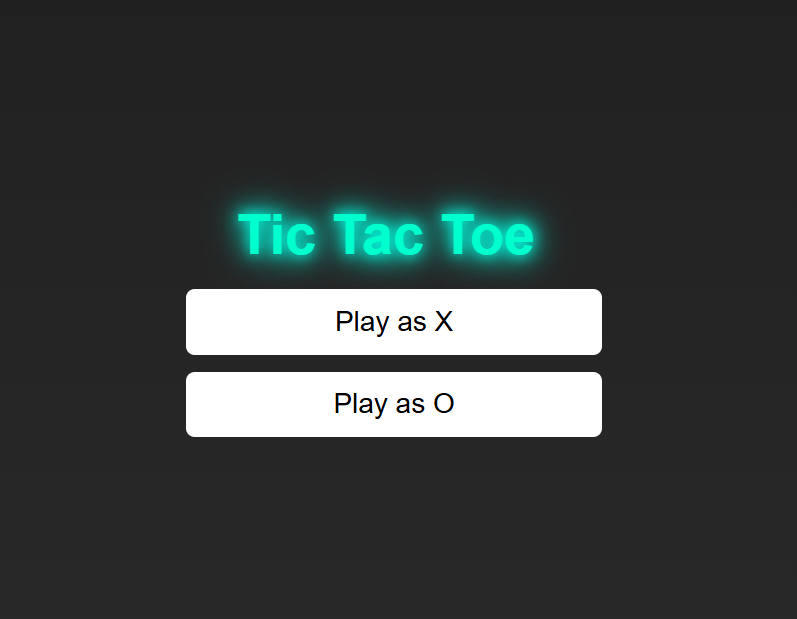
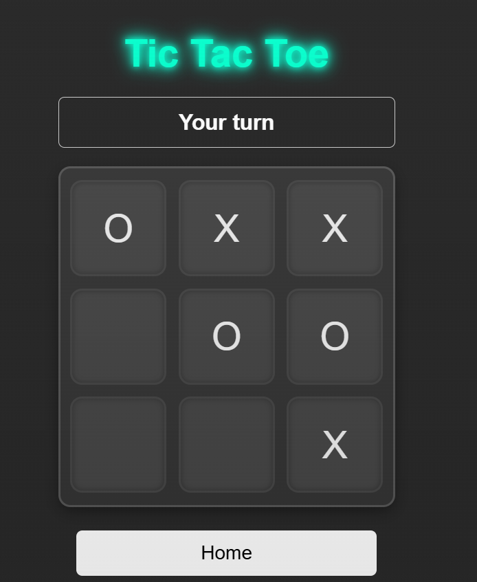
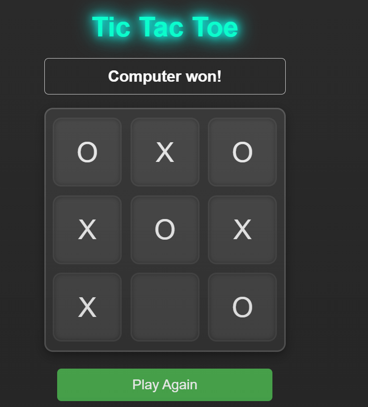

# 🧠 Tic-Tac-Toe AI (Minimax) Game

A responsive, single-player Tic-Tac-Toe game built with HTML, CSS, and JavaScript — featuring an unbeatable AI powered by the **Minimax algorithm**. Play as `X` or `O` against the computer, with smooth UI animations and sound effects for an engaging experience.

## ✨ Features

- 🎮 Play as X or O
- 🤖 Smart AI using Minimax algorithm (perfect play)
- 🟢 Visual feedback while the computer "thinks"
- 🔈 Sound effects for moves and game over
- 🖼️ Responsive design for mobile and desktop
- 💡 Dynamic status updates like "Your turn", "Computer is thinking...", "Computer wins!", etc.

## Play Now
[Play Online](https://shahzad-bangash.github.io/assets/projects/tictactoe/index.html)

## 📸 Screenshots

