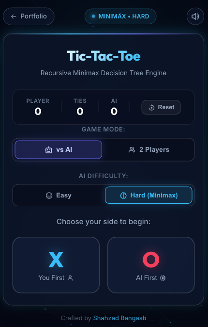
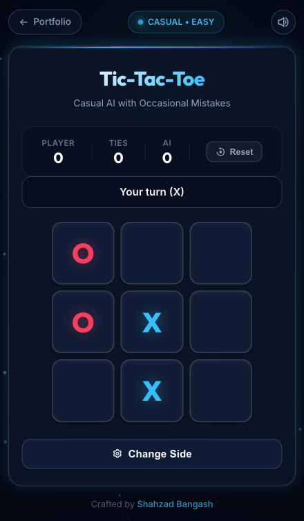
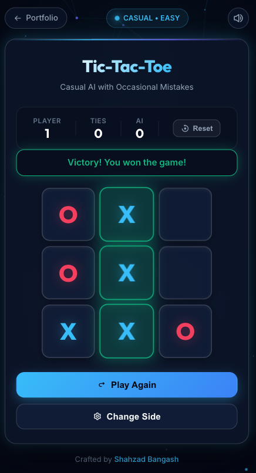

# 🧠 Tic-Tac-Toe AI (Minimax Decision Tree)

A sleek, responsive, glassmorphic Tic-Tac-Toe game featuring an unbeatable AI powered by the **Minimax decision tree algorithm**, built with modern Vanilla HTML5, CSS3, and JavaScript. Play against the computer across **Casual (Easy)** and **Unbeatable (Minimax Hard)** difficulties, or challenge a friend locally in **2-Player Mode**.

---

## 📸 Interface & Gameplay

<div align="center">
  <table>
    <thead>
      <tr>
        <th align="center" width="33.3%">🎮 Mode & Difficulty Select</th>
        <th align="center" width="33.3%">⚔️ Interactive AI Gameplay</th>
        <th align="center" width="33.3%">🏆 Victory & Win Highlight</th>
      </tr>
    </thead>
    <tbody>
      <tr>
        <td align="center">
          
        </td>
        <td align="center">
          
        </td>
        <td align="center">
          
        </td>
      </tr>
    </tbody>
  </table>
</div>

---

## ✨ Features

- 🤖 **Minimax Decision Tree AI**: Mathematically optimal play on Hard difficulty that never loses.
- 🎯 **Dual AI Difficulties**:
  - **Hard (Minimax)**: Exhaustive depth-first search for optimal defense and offensive traps.
  - **Easy (Casual)**: Relaxed AI with occasional human-like mistakes for casual play.
- 👥 **Local 2-Player Mode**: Pass-and-play matches with a friend on the same device.
- 🎵 **Web Audio Synthesizer**: Low-latency, synthesized sound effects for moves, win fanfares, and ties with an instant mute toggle.
- 💎 **Glassmorphism Aesthetic**: Vibrant dark mode with neon cyan (`X`) and coral rose (`O`) glowing accents, backdrop filters, and subtle ambient particle background.
- 📱 **Fully Responsive**: Optimized for phones, tablets, laptops, and desktops.
- 💾 **Persistent Stats**: Tracks Player, AI, and Tie scores with instant reset capability.

---

## 🛠️ Built With

- **HTML5**: Semantic layout and accessible controls
- **Vanilla CSS3**: Modern glassmorphism, flexbox, CSS grid, and smooth micro-animations
- **JavaScript (ES6+)**: Minimax recursion algorithm and Web Audio API synthesizer
- **Boxicons & Google Fonts**: 'Outfit' and 'Inter' typography

---

## 🚀 Getting Started

1. **Clone the repository:**
   ```bash
   git clone https://github.com/shahzad-bangash/tictactoe-ai.git
   ```
2. **Navigate to the directory:**
   ```bash
   cd tictactoe-ai
   ```
3. **Open `index.html`** directly in any modern web browser or launch a local server:
   ```bash
   python3 -m http.server 8000
   ```
   Navigate to `http://localhost:8000/index.html`.

---
